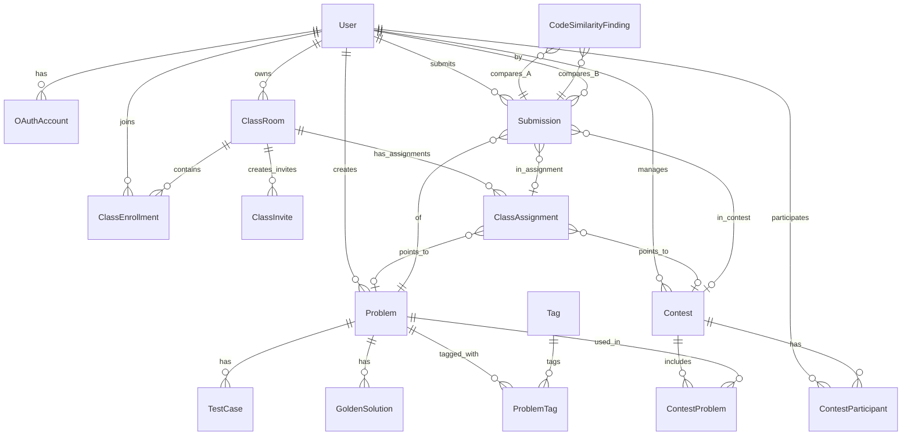

# Sơ đồ Cơ sở dữ liệu (Database Schema)

Tài liệu này mô tả cấu trúc các bảng (Models), kiểu liệt kê (Enums), và mối quan hệ trong cơ sở dữ liệu dựa trên file `schema.prisma`.

---

## 1. Enums (Kiểu liệt kê)

- **Role**: Phân quyền toàn cục của người dùng (`ADMIN`, `CLIENT`).
- **ClassRole**: Vai trò trong một lớp học (`OWNER`, `MEMBER`).
- **ProblemMode**: Chế độ của bài tập/đề bài (`ALGO` - Thuật toán, `PROJECT` - Dự án).
- **Difficulty**: Độ khó của bài tập (`EASY`, `MEDIUM`, `HARD`).
- **ProblemVisibility**: Quyền riêng tư của bài tập (`PRIVATE`, `PUBLIC`, `CONTEST_ONLY`).
- **SubmissionStatus**: Trạng thái chấm bài (`Pending`, `Running`, `Accepted`, `Wrong`, `Error`, `CompilationError`, `TimeLimitExceeded`, `MemoryLimitExceeded`).
- **SubmissionContext**: Ngữ cảnh nộp bài (`PRACTICE`, `CONTEST`, `CLASS_ASSIGNMENT`).
- **ClassEnrollmentStatus**: Trạng thái tham gia lớp (`PENDING`, `ACTIVE`, `REMOVED`, `INVITED`).
- **ContestStatus**: Trạng thái kỳ thi (`DRAFT`, `PUBLISHED`, `RUNNING`, `ENDED`).
- **ContestTestFeedbackPolicy**: Chế độ xem kết quả test case (`SUMMARY_ONLY`, `VERBOSE`).
- **AiJobStatus**: Trạng thái tiến trình chạy AI sinh test (`PENDING`, `RUNNING`, `SUCCEEDED`, `FAILED`).
- **ExportFormat**: Định dạng xuất báo cáo (`XLSX`, `PDF`).
- **ExportJobStatus**: Trạng thái job xuất báo cáo (`PENDING`, `DONE`, `FAILED`).

---

## 2. Models (Các Bảng)

### 2.1. Phân quyền & Tài khoản

| Bảng | Chức năng chính |
|------|-----------------|
| `User` | Lưu trữ thông tin tài khoản người dùng, phân quyền (Role) và liên kết toàn bộ tài nguyên. |
| `OAuthAccount` | Quản lý đăng nhập SSO (Google, Github,...) và liên kết với tài khoản `User`. |

### 2.2. Lớp học & Bài tập

| Bảng | Chức năng chính |
|------|-----------------|
| `ClassRoom` | Lưu trữ các lớp học (Class) và được quản lý bởi một `User` (owner). |
| `ClassEnrollment` | Bản ghi thành viên tham gia lớp (học sinh/thành viên) kèm trạng thái. |
| `ClassInvite` | Lưu trữ token mời tham gia lớp học có thời hạn. |
| `ClassAssignment` | Bài tập được giao trong một lớp, liên kết trực tiếp tới `Problem` hoặc `Contest`. |

### 2.3. Ngân hàng đề bài (Problem)

| Bảng | Chức năng chính |
|------|-----------------|
| `Problem` | Kho đề bài chung của hệ thống (mô tả, giới hạn thời gian/bộ nhớ, chế độ...). |
| `Tag` & `ProblemTag` | Quản lý thẻ phân loại (ví dụ: DP, Graph) cho mỗi đề bài qua bảng phụ `ProblemTag`. |
| `TestCase` | Danh sách test case cho bài toán, bao gồm input, expectedOutput và cờ ẩn `isHidden`. |
| `GoldenSolution` | Các đoạn code chuẩn (mẫu) của bài toán để so sánh hoặc giải thích. |
| `AiGenerationJob` | Lịch sử hoặc job sinh test case / đề bài tự động bởi AI. |

### 2.4. Kỳ thi (Contest)

| Bảng | Chức năng chính |
|------|-----------------|
| `Contest` | Tạo vòng thi đấu/kỳ thi có giới hạn thời gian mở/đóng. |
| `ContestProblem` | Bảng trung gian gộp `Problem` vào `Contest`, cấu hình lại điểm và giới hạn thời gian. |
| `ContestParticipant` | Thí sinh tham gia kỳ thi. |

### 2.5. Chấm điểm & Báo cáo

| Bảng | Chức năng chính |
|------|-----------------|
| `Submission` | Ghi nhận mỗi lần nộp code của người dùng. Chứa log chấm điểm, bộ nhớ, thời gian chạy và điểm số. |
| `ReportExport` | Các công việc trích xuất bảng điểm / báo cáo cho kỳ thi, được chạy ẩn dưới nền (Background Job). |
| `CodeSimilarityFinding` | Báo cáo kiểm tra đạo văn (code similarity) giữa 2 bản ghi `Submission`. |

---

## 3. Sơ đồ thực thể (ER Diagram)

Dưới đây là sơ đồ tương quan cơ bản biểu thị quan hệ giữa các mô hình dữ liệu chính trong hệ thống:

